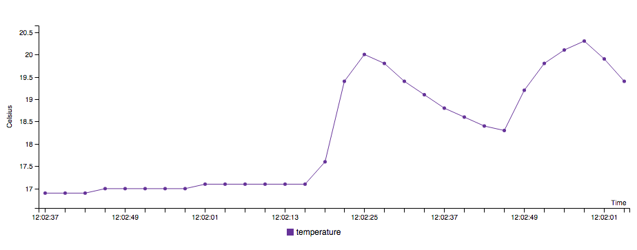
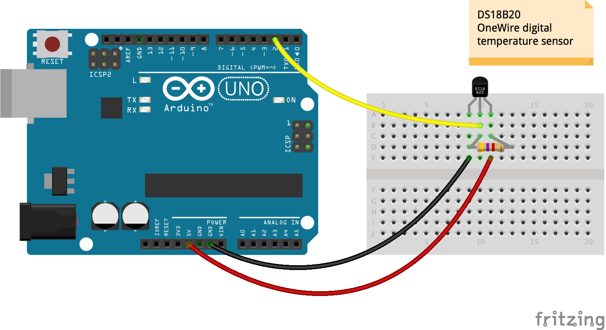

# EON Demo from sensor data using Arduino and Johnny-Five

You need to install *Johnny-Five* and *PubNub* to run the node.js code with Arduino.

```bash
$ npm install johnny-five
```

```bash
$ npm install pubnub
```

## Overview on Publishing from Hardware & Subscribing to Plot a Graph on Browser

### Publishing the Sensor Data to PubNub

Once you get the data from the sensor, send the data to PubNub.

```javascript
var pubnub = require('pubnub')({
  publish_key: 'YOUR_PUB_KEY',
  subscribe_key: 'YOUR_SUB_KEY'
});

var data = { eon: {
  'temperature': temp
}};

pubnub.publish({
  channel: 'temperature-ds18b20',
  message: data,
});

```

### Data Visualization with EON

The basic graph can be drawn with EON's `chart()` as it receives the data from PubNub.

Chart type can be specified with `data.type`. In this example, it is a simple line graph:

```html
<div id="temp"></div>
```

```javascript
var pubnub = PUBNUB.init({
  publish_key: 'YOUR_PUB_KEY',
  subscribe_key: 'YOUR_SUB_KEY'
});

eon.chart({
  channel: 'temperature-ds18b20',
  generate: {
    bindto: '#temp', 
    data: {
      type: 'line'
    }
  }
},
pubnub: pubnub,
transform: function(m) {
  return { eon: {
      temperature: m.eon.temperature
    }}
  }
});
```

To customize the chart (e.g. changing line colors, adding labels, etc.), please refer [C3.js docs](http://c3js.org/gettingstarted.html#customize).


#### Run the HTML File

For eaxmple, to view the temperature line graph, run `/temperature/temperature.html` file on local server:

```bash
$ python -m SimpleHTTPServer 8000
```

Then go to `localhost:8000` on browser, and run `temperature.html`



## Hardware Wiring

### Temperature

The temperature data comes from a [DS18B20](http://www.maximintegrated.com/en/products/analog/sensors-and-sensor-interface/DS18S20.html) sensor, and it is published to PubNub.

When you are using Arduino with Johnny-Five, you need to install **ConfigurableFirmata** to your Arduino to be able to run the code. The code requires OneWire support using the ConfigurableFirmata.


#### Installing ConfigurableFirmata

1. Connect your Arduino to computer with a USB cable
2. On [Arduino IDE](https://www.arduino.cc/en/Main/Software), go to **Sketch** > **Include Library** > **Manage Libraries**
3. Search for "ConfigurableFirmata"
4. Click the result, then click **Install**
5. Go to **File** > **Examples** > **ConfigurableFirmata** > **ConfigurableFirmata**
6. Upload the code to the device

Now, you are done with Arduino IDE. You can close it and switch to your fave IDE (or keep using Arduino IDE if you like).

#### Arduino Wiring





#### Run the Node.js to Get Temperature from the Sensor

Run *temperature.js*:

```bash
$ node temperature.js
```

### Photoresistor (Ambient Light Sensor)

TBD

### Potentiometer 

TBD

### DS18S20, Photoresistor, and Potentiometer in one breadboard


